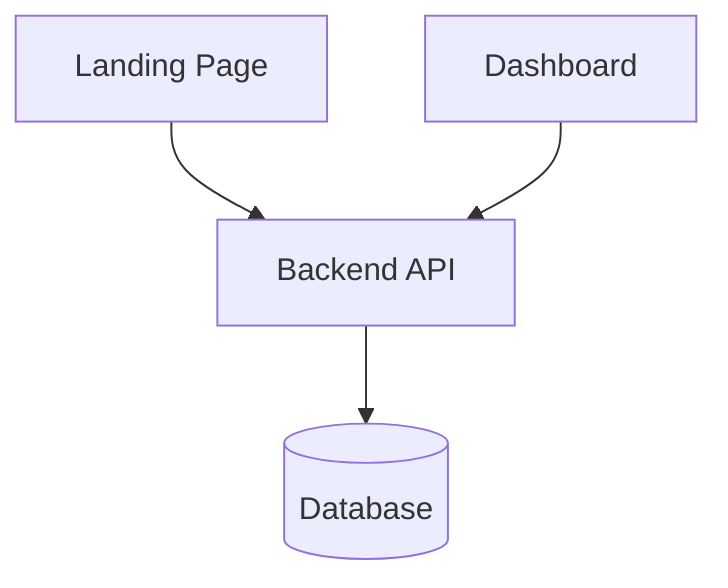
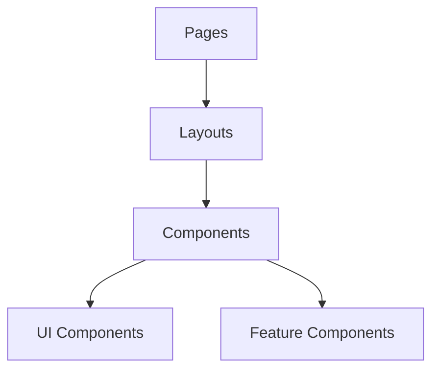
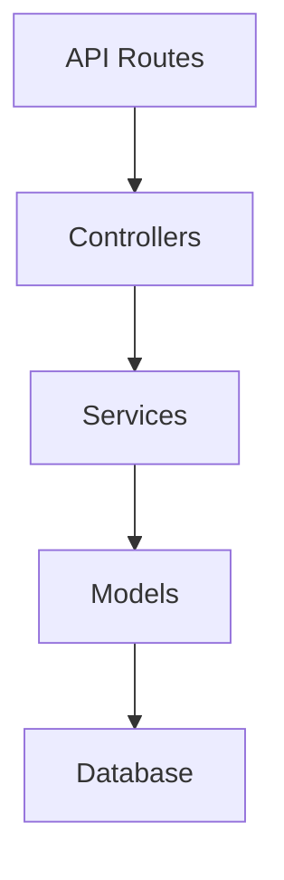

# System Patterns

## Architecture Overview
The system follows a microservices architecture with three main applications:

## Design Patterns

### Frontend Patterns
1. **Component Architecture**
   - Reusable UI components
   - Atomic design principles
   - Component composition
   - State management with React hooks

2. **Authentication Flow**
   - Organization-based authentication
   - Protected routes
   - Session management
   - Role-based access control

3. **UI/UX Patterns**
   - Dark theme implementation
   - Responsive design
   - Loading states
   - Error handling
   - Form validation

### Backend Patterns
1. **API Design**
   - RESTful endpoints
   - Middleware for authentication
   - Error handling middleware
   - Request validation

2. **Database Patterns**
   - Prisma ORM for database operations
   - Multi-tenant data isolation
   - Migration management
   - Data validation

3. **Security Patterns**
   - JWT authentication
   - Environment variable management
   - CORS configuration
   - Rate limiting

## Component Relationships

### Frontend Components

### Backend Services

## Key Technical Decisions

1. **Framework Selection**
   - Next.js for frontend applications
   - Node.js/TypeScript for backend
   - Prisma for database operations
   - Tailwind CSS for styling

2. **State Management**
   - React hooks for local state
   - Context API for global state
   - Custom hooks for shared logic

3. **API Communication**
   - RESTful API design
   - Axios for HTTP requests
   - Error handling middleware
   - Request/response interceptors

4. **Styling Approach**
   - Tailwind CSS for utility-first styling
   - Custom component library
   - Dark theme support
   - Responsive design utilities 